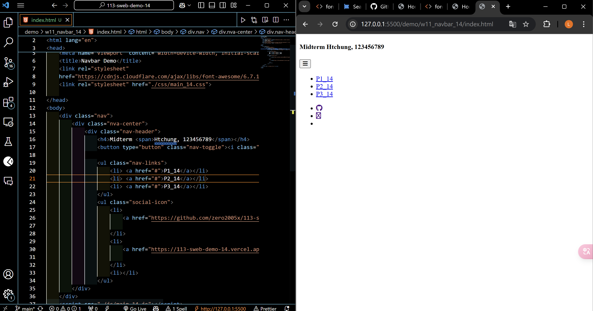
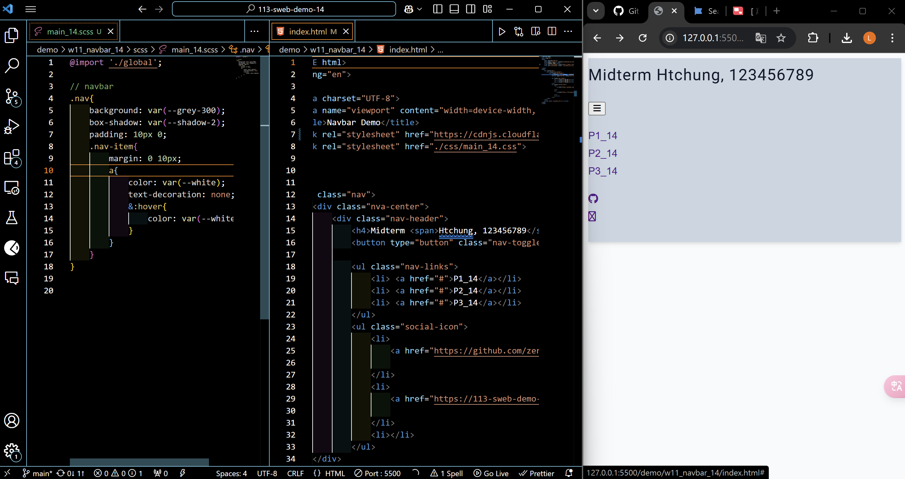
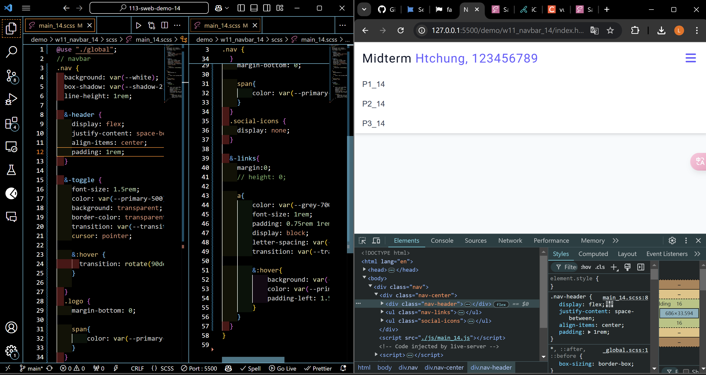
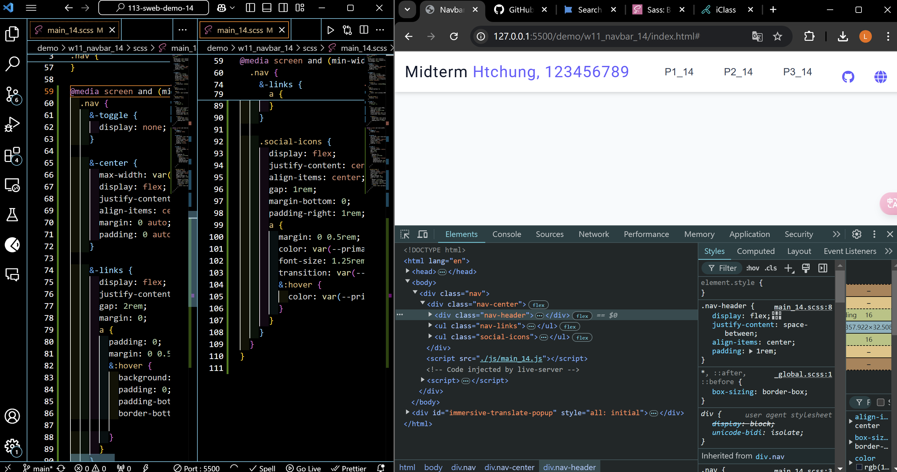
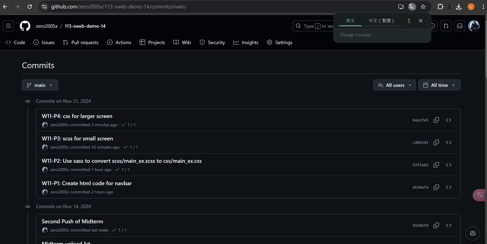

###  W11-P1: Create html code for navbar
 

 
```
eb58efa%09zero2005x%09Thu Nov 21 19:02:14 2024 +0800    W11-P1: Create html code for navbar
```


### W11-P2: Use sass to convert scss/main_xx.scss to css/main_xx.css
 


```
eb58efa%09zero2005x%09Thu Nov 21 19:02:14 2024 +0800    W11-P1: Create html code for navbar
```

### W11-P3: scss for small screen



```
cd06543%09zero2005x%09Thu Nov 21 20:30:43 2024 +0800    W11-P3: scss for small screen
```

### W11-P4: css for larger screen



```
b4a3fe5%09zero2005x%09Thu Nov 21 21:02:38 2024 +0800    W11-P4: css for larger screen
```

### W11-P5: git logs for W11



```
a6749ec%09zero2005x%09Thu Nov 21 21:09:24 2024 +0800    W11-P5: git logs for W11
b4a3fe5%09zero2005x%09Thu Nov 21 21:02:38 2024 +0800    W11-P4: css for larger screen
cd06543%09zero2005x%09Thu Nov 21 20:30:43 2024 +0800    W11-P3: scss for small screen
53f5a82%09zero2005x%09Thu Nov 21 19:38:50 2024 +0800    W11-P2: Use sass to convert scss/main_xx.scss to css/main_xx.css
eb58efa%09zero2005x%09Thu Nov 21 19:02:14 2024 +0800    W11-P1: Create html code for navbar
```