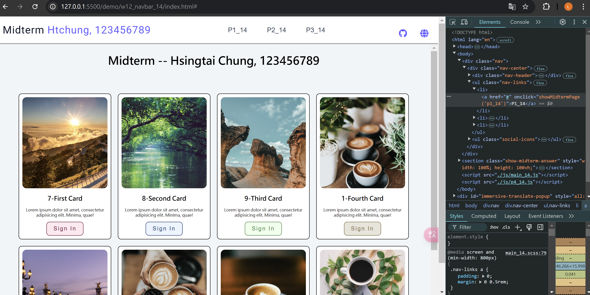
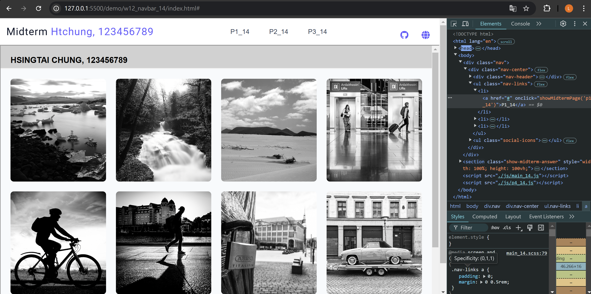
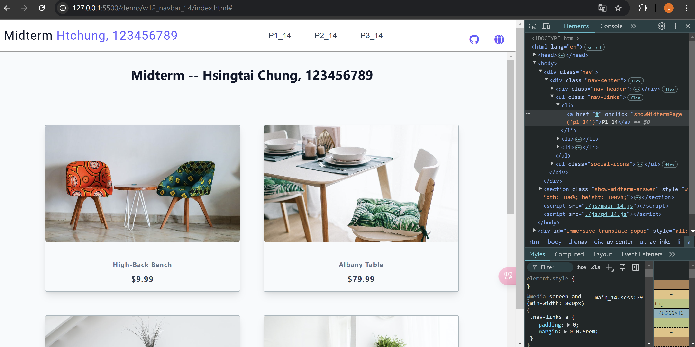
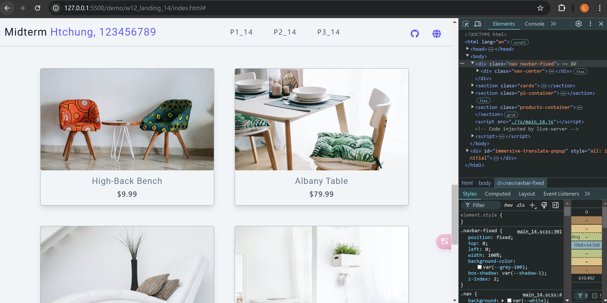
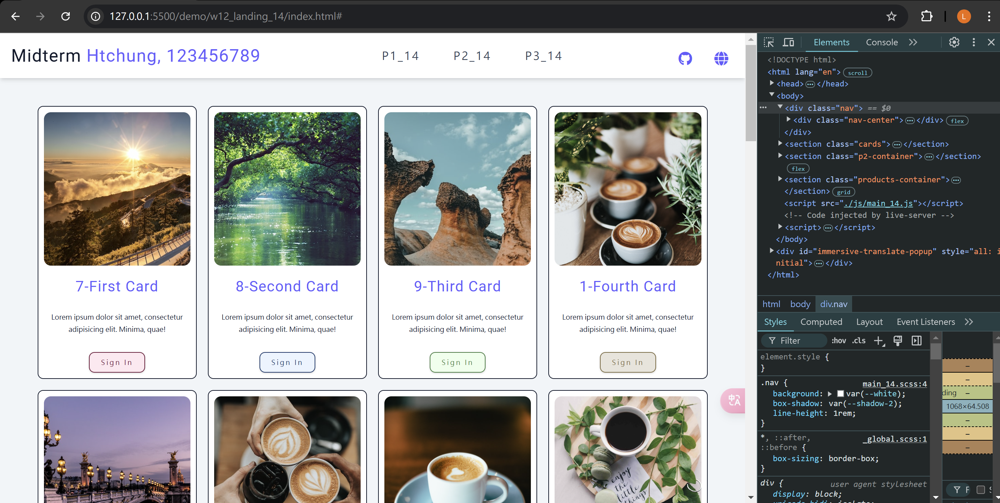
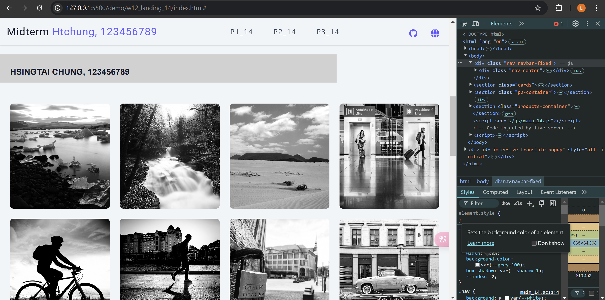
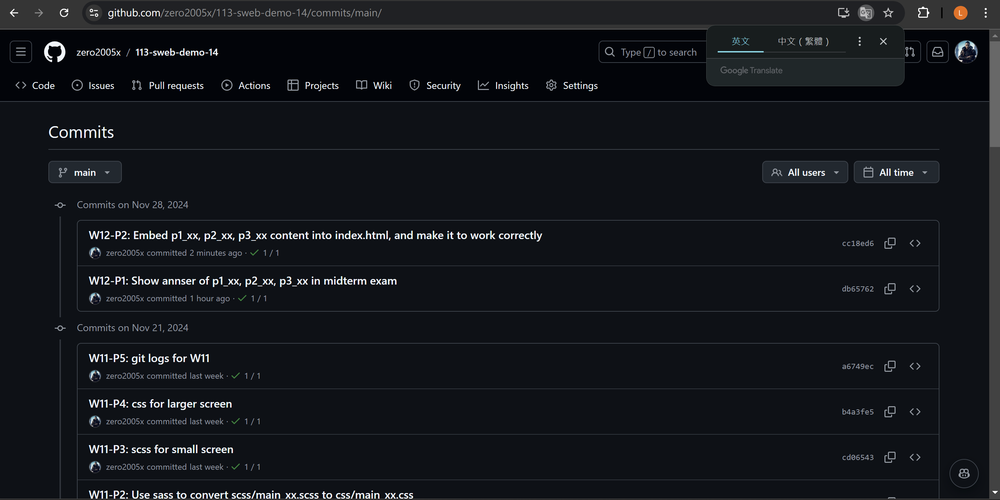

W12-P1: Show answer of p1_xx, p2_xx, p3_xx in midterm exam
 
#### => show p1_xx
 



 
#### => show p2_xx
 



 
#### => show p3_xx
 



 
```
db65762%09zero2005x%09Thu Nov 28 19:33:28 2024 +0800    W12-P1: Show annser of p1_xx, p2_xx, p3_xx in midterm exam
```

### W12-P2: Embed p1_xx, p2_xx, p3_xx content into index.html, and make it to work correctly
 
#### => select p3_xx nav link, navbar-fixed will be displayed
 

 
#### => select p1_xx nav link, navbar-fixed will be removed
 

 
#### => select p2_xx nav link, navbar-fixed will be displayed
 

 

```
cc18ed6%09zero2005x%09Thu Nov 28 20:49:08 2024 +0800    W12-P2: Embed p1_xx, p2_xx, p3_xx content into index.html, and make it to work correctly
```

### W12-P5: git logs for W12




