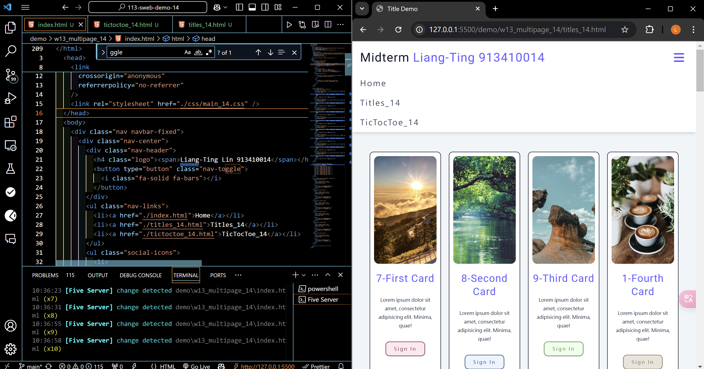
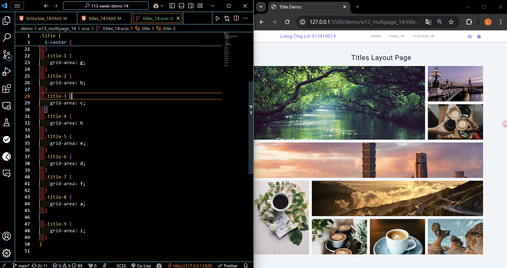
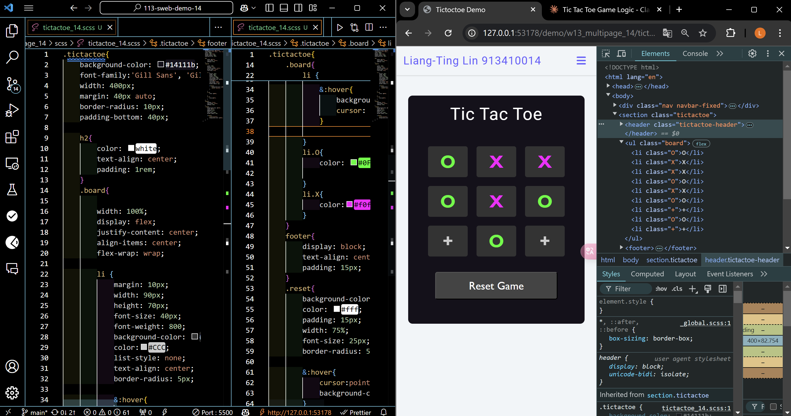
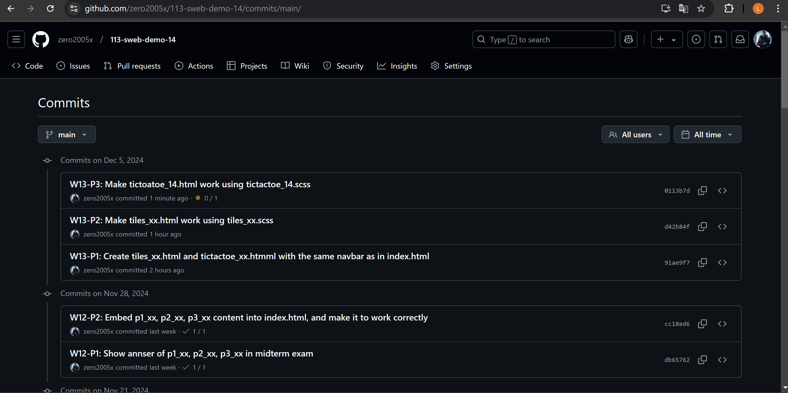

###    W13-P1: Create tiles_14.html and tictoatoe_14.html with the same navbar as in index.html



```
91ae9f7%09zero2005x%09Thu Dec 5 18:43:53 2024 +0800      W13-P1: Create tiles_xx.html and tictactoe_xx.htmml with the same navbar as in index.html
```

###    W13-P2: Make tiles_xx.html work using tiles_xx.scss




```
91ae9f7%09zero2005x%09Thu Dec 5 18:43:53 2024 +0800      W13-P1: Create tiles_xx.html and tictactoe_xx.htmml with the same navbar as in index.html
```

###    W13-P3: Make tictoatoe_14.html work using tictactoe_14.scss



```
0113b7d%09zero2005x%09Thu Dec 5 20:52:22 2024 +0800     W13-P3: Make tictoatoe_14.html work using tictactoe_14.scss
```

### W13-P4: git logs ofr W13



```
0113b7d%09zero2005x%09Thu Dec 5 20:52:22 2024 +0800     W13-P3: Make tictoatoe_14.html work using tictactoe_14.scss
d42b84f%09zero2005x%09Thu Dec 5 19:31:48 2024 +0800     W13-P2: Make tiles_xx.html work using tiles_xx.scss
91ae9f7%09zero2005x%09Thu Dec 5 18:43:53 2024 +0800      W13-P1: Create tiles_xx.html and tictactoe_xx.htmml with the same navbar as in index.html
```