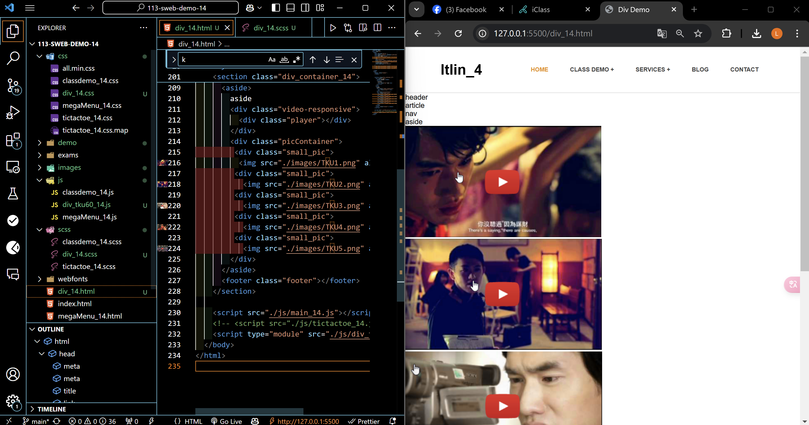

[Your Github URL](https://github.com/zero2005x/113-sweb-demo-14)

[Your Vercel URL](https://vercel.com/larry-lins-projects/113-sweb-demo-14)

###  W15-P1: Setup div_xx.html, div_xx.scss, div_tku60_xx.js
 

 
```
7d01877%09zero2005x%09Thu Dec 19 19:59:15 2024 +0800    W15-P1: Setup div_xx.html, div_xx.scss, div_tku60_xx.js
```

###  W15-P2: Show div_14.html correctly

#### => select tku60 pic 3, and show relevant youtube video


```

```


#### => html, and js code for showing video 3


```

```

###  W15-P3: make div_14.html responsive


```
f0d30af%09zero2005x%09Sat Dec 21 18:41:34 2024 +0800    W15-P3: make P2 div_xx.html responsive
```
###  W15-P4: show absolute positioning in project_14.html


```
d69102b%09zero2005x%09Sat Dec 21 18:15:27 2024 +0800    W15-P4: show absolute positioning in project_14.html
```


###   W15-P5:  git logs of W15

#### => Show in local


#### => Show in Vercel 


### W14-P4: git logs for W15


