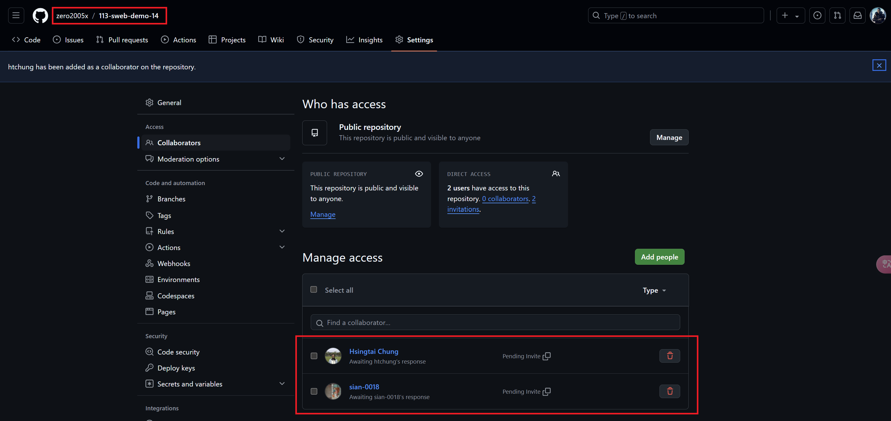
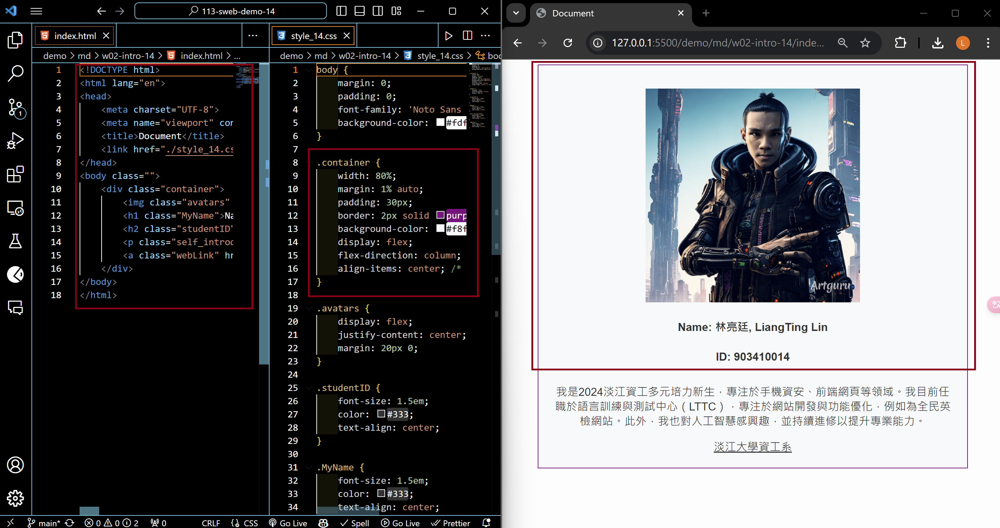

### W02-P1: Collaborate your Github repo to htchung@gms.tku.edu.tw and sian-0018 (TA)



```
9c4e33c%09zero2005x%09Thu Sep 19 19:20:12 2024 +0800    W02-P1: Collaborate your Github repo to htchung@gms.tku.edu.tw and sian-0018 (TA)
```

### W02-P2: My Introduction using tag with css selector (container)




### W02-P3: git logs of W2

```
faf1c4f%09zero2005x%09Thu Sep 19 20:28:39 2024 +0800    W02-P2: My Introduction using tag , <a>, <h1>, <h2>, <p> with css selector (container)
9c4e33c%09zero2005x%09Thu Sep 19 19:20:12 2024 +0800    W02-P1: Collaborate your Github repo to htchung@gms.tku.edu.tw and sian-0018 (TA)       
9dc8ed2%09zero2005x%09Thu Sep 19 19:06:22 2024 +0800    第二周第一次上傳
```
