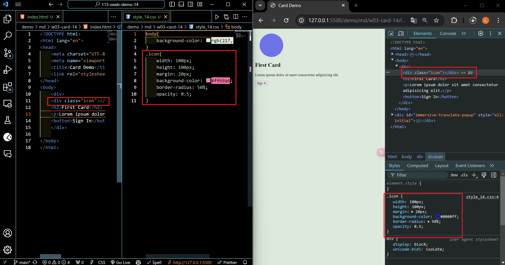
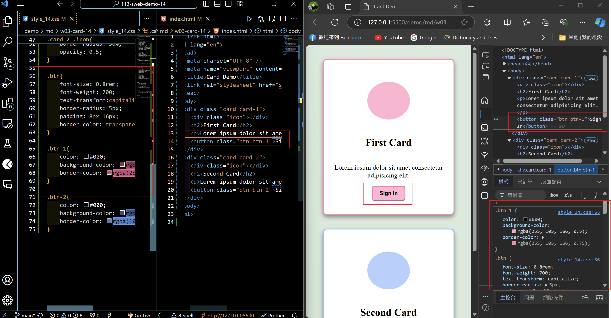
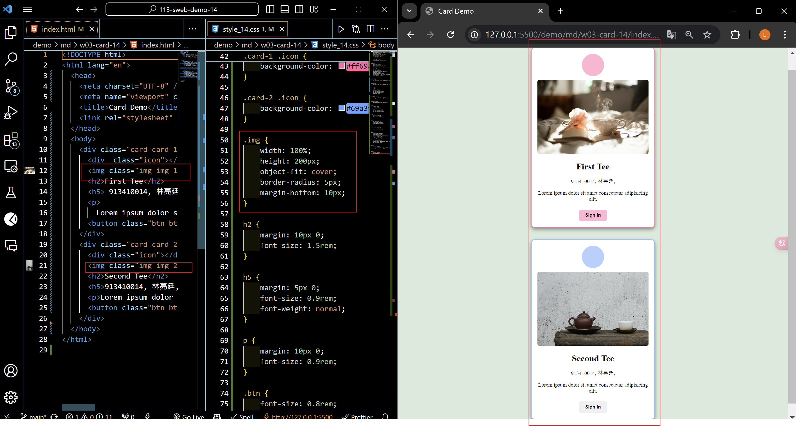

[My Github URL](https://github.com/zero2005x/113-sweb-demo-14)


### W03-P1: Show first card and change color using DevTools



```
f98aa0d%09zero2005x%09Thu Sep 26 19:12:44 2024 +0800    W03-P1: Show first card and change color using DevTools, second
ed89eef%09zero2005x%09Thu Sep 26 19:09:41 2024 +0800    W03-P1: Show first card and change color using DevTools
```


### W03-P2: Show btn and btn-1 class selector in DevTools compare to that in HTML and CSS



```
f011bd4%09zero2005x%09Thu Sep 26 20:55:18 2024 +0800    Show 2 photos with the same height, remain photo ration, and show .img class selector
```


### W03-P3: Show 2 photos with the same height, remain photo ration, and show .img class selector



```
f011bd4%09zero2005x%09Thu Sep 26 20:55:18 2024 +0800    Show 2 photos with the same height, remain photo ration, and show .img class selector
```

### W03-P3: git logs of Week3


```
(base) PS C:\Tamkang\113-sweb-demo-14> git log --pretty=format:"%h%09%an%09%ad%x09%s"  --after="2024-09-25"
f011bd4%09zero2005x%09Thu Sep 26 20:55:18 2024 +0800    Show 2 photos with the same height, remain photo ration, and show .img class selector
f98aa0d%09zero2005x%09Thu Sep 26 19:12:44 2024 +0800    W03-P1: Show first card and change color using DevTools, second
ed89eef%09zero2005x%09Thu Sep 26 19:09:41 2024 +0800    W03-P1: Show first card and change color using DevTools
```