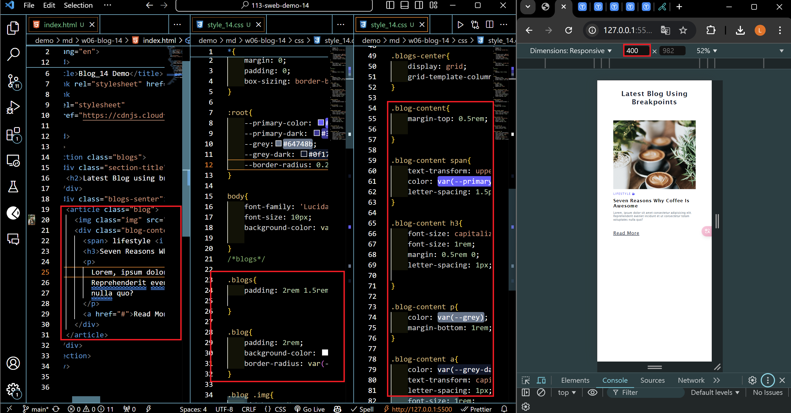
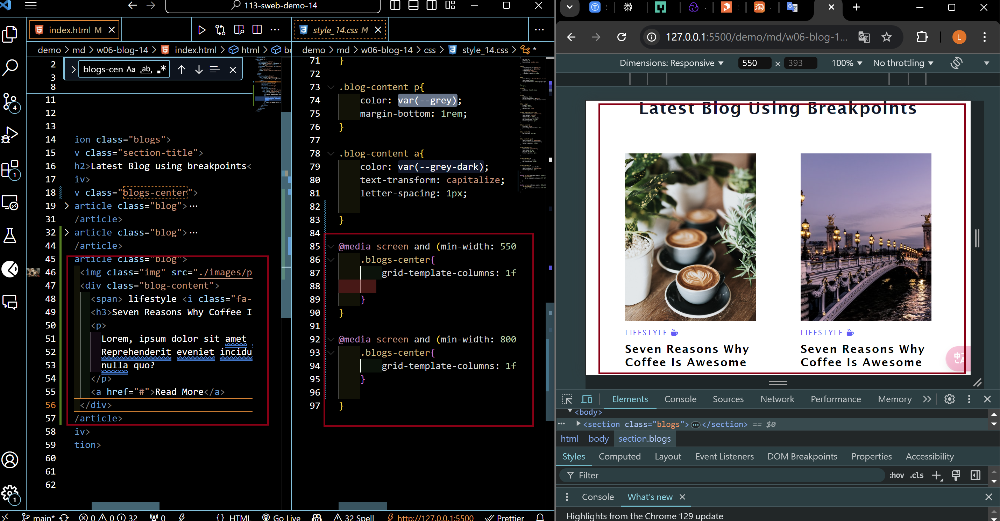
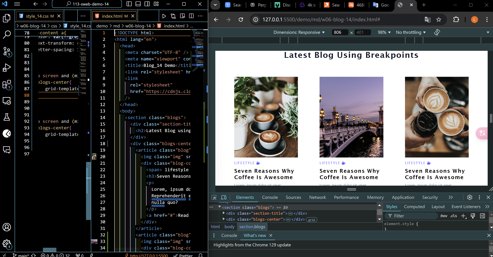
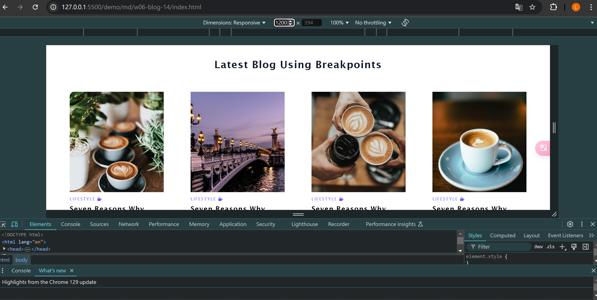
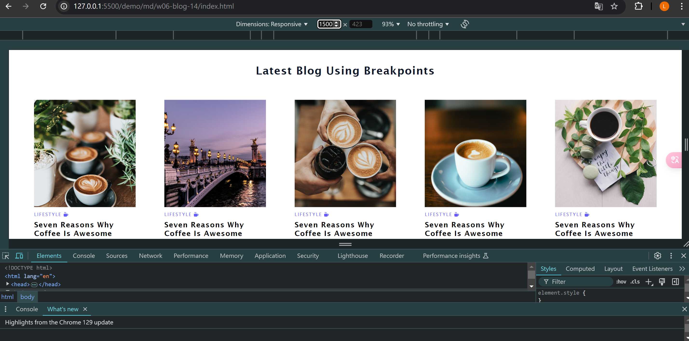
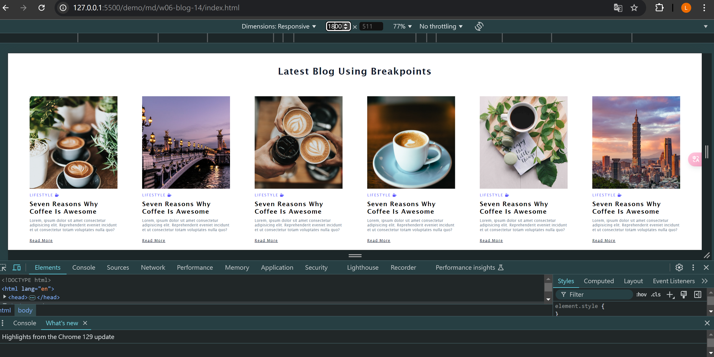
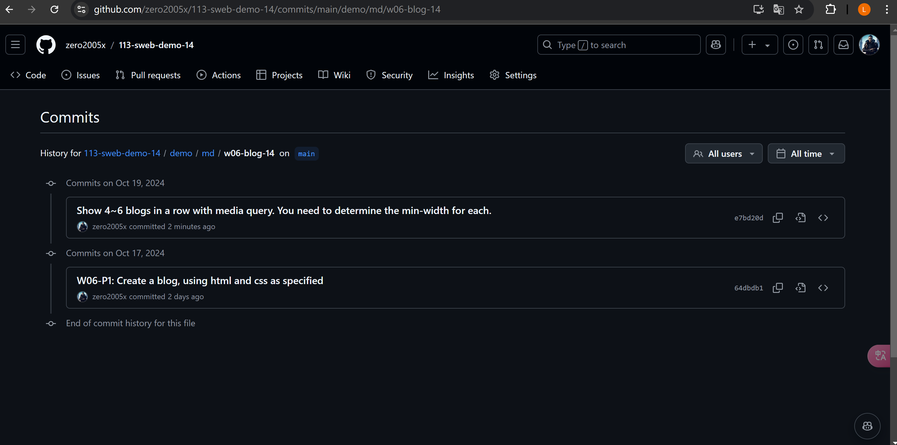

### W06-P1: Create a blog, using HTML and CSS as specified



```
64dbdb1    zero2005x    Thu Oct 17 20:03:04 2024 +0800    W06-P1: Create a blog, using HTML and CSS as specified
```

---

### W06-P2: Show 2 blogs in a row with media query (min-width: 550px)



---

### W06-P3: Show 3 blogs in a row with media query (min-width: 800px)



---

### W06-P4: Show 4~6 blogs in a row with media query. You need to determine the min-width for each.

#### Show 4 blogs in a row (min-width: 1200px)



#### Show 5 blogs in a row (min-width: 1500px)



#### Show 6 blogs in a row (min-width: 1800px)



```
e7bd20d    zero2005x    Sat Oct 19 20:32:01 2024 +0800    Show 4~6 blogs in a row with media query. You need to determine the min-width for each.
```

---

### W06-P5: Git logs of W06




