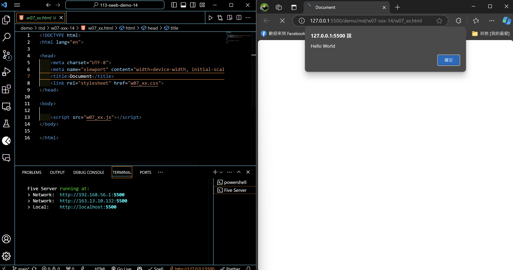
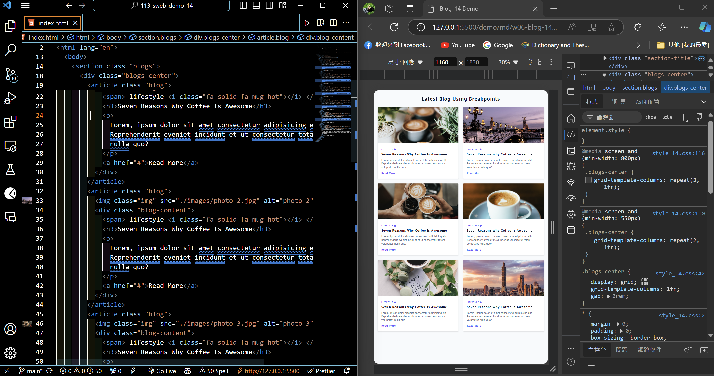
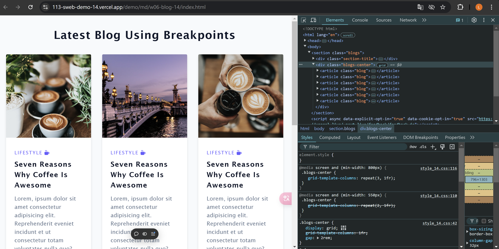
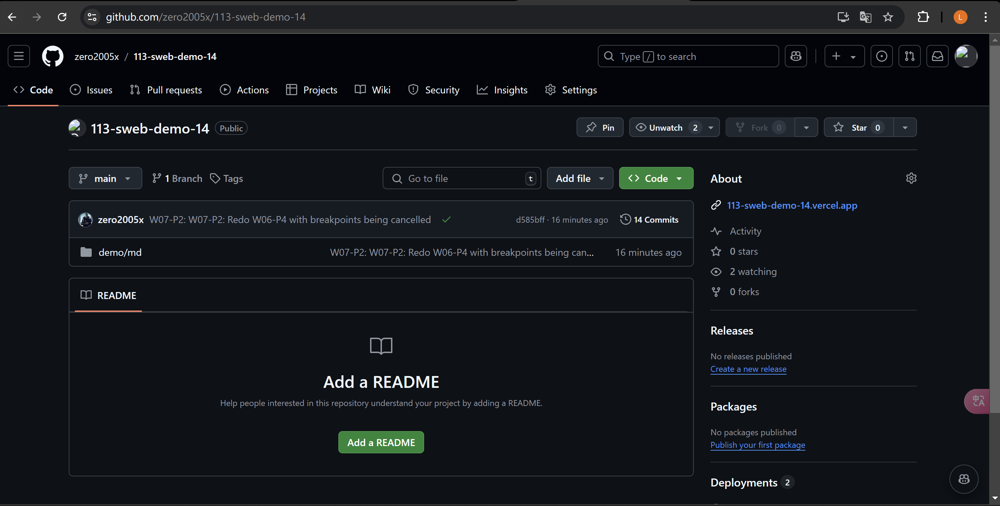
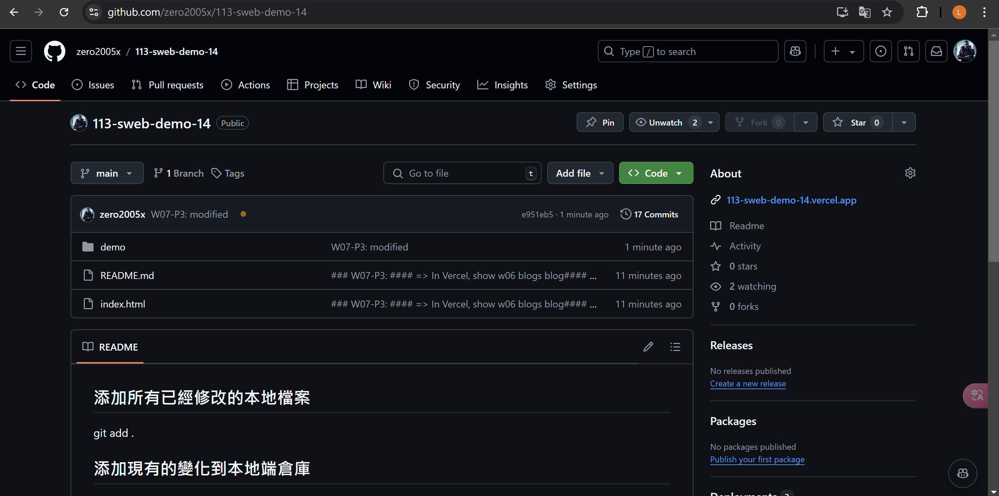

[My Github URL](https://github.com/zero2005x/113-sweb-demo-14)

[My Vercel URL](https://w07-showdemo-14.vercel.app/)

### W07-P1: Test css and js for w07_xx.html



```
d585bff%09zero2005x%09Thu Oct 24 19:17:10 2024 +0800    W07-P2: W07-P2: Redo W06-P4 with breakpoints being cancelled
```

### W07-P2: W07-P2: Redo W06-P4 with breakpoints being cancelled





### W07-P3:

#### => In Vercel, show w06 blogs blog




#### => Show your Github repo with Vercel URL

[My Vercel URL](https://w07-showdemo-14.vercel.app/)



```
d585bff%09zero2005x%09Thu Oct 24 19:17:10 2024 +0800    W07-P2: W07-P2: Redo W06-P4 with breakpoints being cancelled
```

#### => To create index.html as root home page and have a link to class demo navigation as done in w07



```
6b90ff2%09zero2005x%09Thu Oct 24 20:07:56 2024 +0800    modified the root index.html's link to w07 3rd
```
