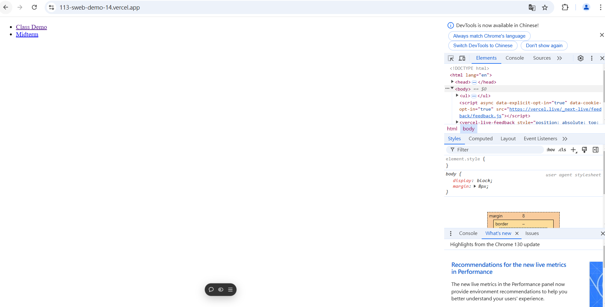

# (40%) 靜態網頁 期中考 2 -- 開放網路考試

##### 2024-11-14, at E201

#### Note:

1. 請不要發揮同學愛，作弊雙方除了本次考試 0 分外，平常分數另扣 20 分，情節嚴重者會送校。
2. iClass 上請繳交 mid2_xx.pdf，還有 mid2_md.zip 兩個壓縮檔
3. 請直接將答案寫在 mid2_md_xx/mid2_xx.md 上，老師出題及圖片放在 mid2_htc.pdf 上，請依照老師所給的圖片來實作並標註
4. 跟小考相關的檔案及目錄名稱有 xx 時，必須要改成學號後 2 碼，沒有修改時，會視違犯情況扣分。
5. 每一張圖片要有機房左側背景，圖片上要有你的學號(或後兩碼)，圖片標註要跟老師所標註的類似。違者會依情節扣分。
6. 請自評分數，將每一題的 ? 填入分數，沒有填者，不會批改，以 0 分計算。

##### Your (Name, ID): (林亮廷, 913410014)

- P1 (6%): 6 分
- P2 (6%): 6 分
- P3 (6%): 6 分
- P4 (6%): 6 分
- P5 (16%): 16 分

##### 總分: 40 分

---

#### (6%) P1: Show Your Github Repo for class demo

##### => My Github repo URL & Vercel URL

[My Github URL]()

[My Vercel URL]()

#### Your Answer

##### => 點選後要能夠連到你個人所維護的 Github & Vercel URL

[Your Github URL](https://github.com/zero2005x/113-sweb-demo-14)

[Your Vercel URL](https://vercel.com/larry-lins-projects/113-sweb-demo-14)

---

#### (6%) P2: Show class demo of week 2, 3, 6 and 7 with md files (6 weeks)

#### Your Answer

#### (6%) P3: Show your git logs for week W7, W6, W3

##### => My Github logs for week W7, W6, W3

#### Your Answer

---

#### (6%) P4: Show w06 class demo in Vercel using navigation from w7_xx.html

##### => In Vercel, show 3 photos in a row, each phot with the correct icons

[Vercel URL for week 06 demo from w7_xx.html]()

#### Your Answer

##### => 點選後要透過 Vercel URL 呈現

[Your Vercel URL for week 06 demo from w7_xx.html](https://113-sweb-demo-14.vercel.app/demo/w07_showdemo_14/w07_showdemo_14.html#)

---

#### (16%) P5: 將期末考 1 之答案，放入 Github 中，並能透過 Vercel 呈現，規格如下：

##### => 目錄結構如下

##### => 在最外層之根目錄 index.html，加入一個選項 Midterm，點選後能夠執行 exams/midterm/mid1_xx/p4_xx.html，顯示 mid1 考試之選單

##### => mid1 考試 code, git push to Github

下面 Github URL 連結，可以直接連到本題答案截圖

[Github URL for P5]()

##### => 顯示 Vercel 首頁如下圖

下面 Vercel URL 連結，可以直接連到首頁如下圖

[Vercel URL]()

##### => 點選 Midterm 可以連到 mid1 考題之 p4_xx.html

請點選 p1_xx 選項，顯示 p1_xx.html

#### Your Answer

##### => 在最外層之根目錄 index.html，加入一個選項 Midterm，點選後能夠執行 exams/midterm/mid1_xx/p4_xx.html，顯示 mid1 考試之選單

##### => mid1 考試 code, git push to Github

下面 Github URL 連結，可以直接連到本題答案截圖

[Github URL for P5](https://github.com/zero2005x/113-sweb-demo-14/tree/main/exams/midterm/mid1_md_14)

##### => 顯示 Vercel 首頁如下圖

下面 Vercel URL 連結，可以直接連到首頁如下圖

[Vercel URL](https://113-sweb-demo-14.vercel.app/)

##### => 點選 Midterm 可以連到 mid1 考題之 p4_xx.html

請點選 p1_xx 選項，顯示 p1_xx.html

